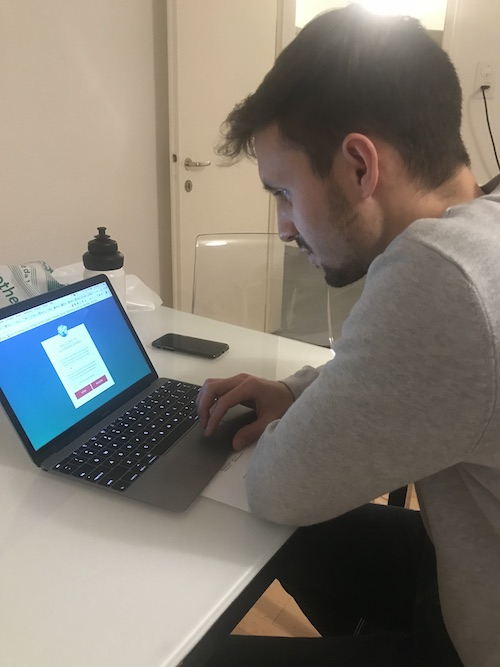

## User Test mit SL 26.12.2017

# Feedback

 Allgemein: "Intuitives Spiel, das die Motivationspanne durch regelmässige Belohnungen hoch hält"
 
- [x] Titel auf der Startseite schlecht leserlich 'Globeracer80' --> (Abstand zwischen Globeracer und 80 hinzufügen)
- [x] Tippfehler: 'You' 
- [x] Tippfehler: '1 Meters to Achievement'
- [x] ein Achievement hinzufügen bevor man das Italien Level erreicht, sonst geht Spielspass verloren
- [x] Odometer Zahlen mit ‘ anstelle des Kommas trennen
